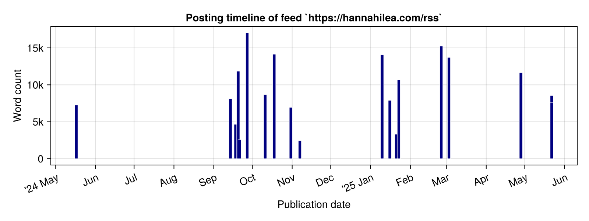
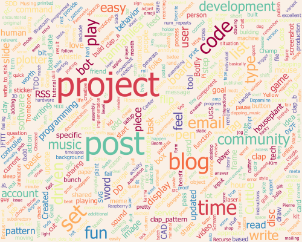
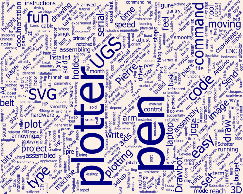
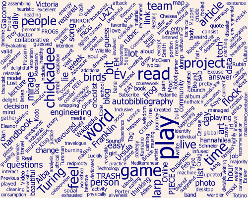

# rss-viz
[]("https://www.hannahilea.com/blog/houseplant-programming")

Scrappy script for generating analysis plots of the type in [this post](https://hannahilea.com/blog/blog-birthday-1/), taking an RSS feed as input.

No tests! No CI! No promised maintenance! 

## Usage

1. [Install Julia](https://julialang.org/install/)
2. Clone this repo
3. Find the RSS feed for your site of interest, e.g., `https://hannahilea.com/rss`
4. From the directory containing this script, run it either via REPL or commandline. In either case, you'll be prompted for both the url to the RSS feed and a (local) output directory in which to put the plots. The output directory need not yet exist, and will be created relative to the current working directory.
    1. Via commandline: 
        ```
        # first time only
        julia --project=. -e 'using Pkg; Pkg.instantiate;'

        # every time, to run script
        julia --project=. run.jl
        ```
    
    2. Via REPL:
        1. Launch REPL via `julia --project=.`
        2. First time only
        ```julia
        julia> using Pkg
        julia> Pkg.instantiate()
        ```
        3. Run script
        ```julia
        julia> include("run.jl")
        ```

Note that it may take awhile both to do the initial instantiation and to generate the first of the word clouds; after that, it'll speed up.

## Commentary

There are lots of customization options to, e.g., word cloud generation and custom header/footer removal and plot size; this script is scrappy enough that you'd be better off changing the code directly! Assume that this is *not* a beautifully engineered library that nicely inverts control to the caller. 😅

Oh, and if you want some examples of wordcloud customizations supported by WordCloud.jl library used here, there's a [gallery](https://github.com/guo-yong-zhi/WordCloud-Gallery/blob/main/README.md).
To see the list of available color mappings, do 
```
using WordCloud
using ImageInTerminal
WordCloud.displayschemes()
```

## Output

The following plots are generated via this script from RSS feed [`https://hannahilea.com/rss`](https://hannahilea.com/rss):




and a couple of the per-blog word cloud posts:
[](https://hannahilea.com/blog/ly-drawbot-setup/)
[](https://hannahilea.com/blog/autobibliography-2/)


